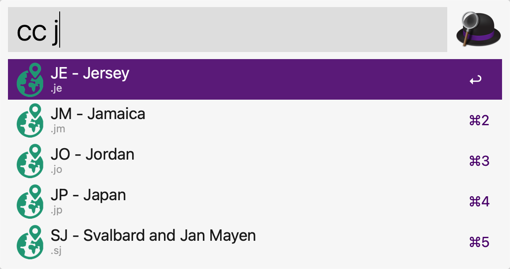

# Country codes

Provides fast lookup of 2-letter country codes and associated TLDs for the [Alfred launcher for macOS](https://alfredapp.com/).

The standard used is [ISO 3166 Alpha 2](https://en.wikipedia.org/wiki/ISO_3166-1_alpha-2).




## Installation

Open `Country codes.alfredworkflow` and follow Alfred's prompts.

## Usage

Open Alfred (by default, ⌘+space) and type:

```
cc <search term>
```


## Plans

Add IATA airport codes too, as they're used in Cloudflare Ray IDs.
